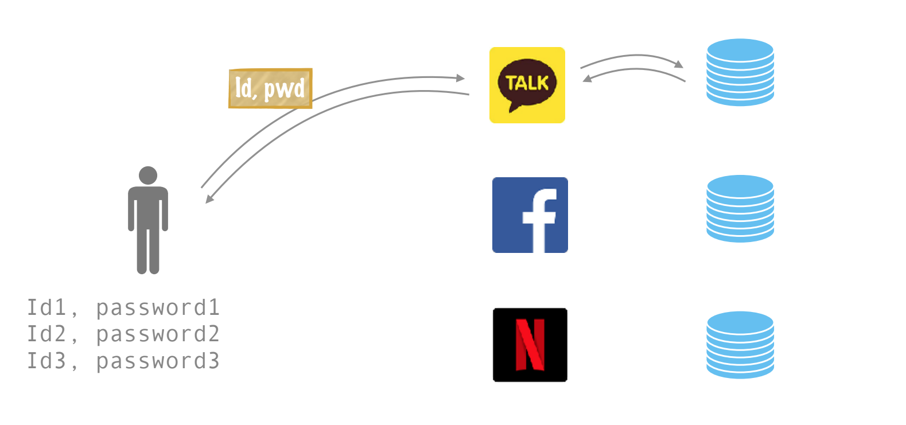

# SSO (single Sign on) (통합 인증 방식)

## SSO 란 무엇인가? 
### SSO 가 왜 필요한가? 
각기 다른 서비스는 각자 다른 방식으로 로그인을 요구한다. 또한 다른 방식으로 로그인을 처리하고 사용자 정보를 저장하는 방식 또한 다르다.

(사진 출처 - https://hanee24.github.io/2018/08/04/sso/)

그런데 만약 위의 앱들이 독립적으로 작동하지만 서로 연관된 무언가가 있다면? 예를 들어 지메일, 행아웃, 구글드라이브 등 을 각자 다른 아이디, 인증 방식으로 로그인 해야 한다면? 너무나 불편 할 것이다. 개발자 입장에서도 로그인 화면을 다 따로 만들어 줘야 하고 DB, 로그인 프로세스도 각자 구현 해야 하고 데이터 싱크도 구현 해야 한다. 사용자와 개발자 모두 불편한 상태가 된다. 

## 그래서 SSO가 뭐냐고 임마. 

위의 불편을 해소 할 수 있게 한 인증 방식이 SSO이고 길게 유식하고 불편하게 부르려면 Single Sigon On이라고 하면 된다. 여러 서비스를 로그인 한번으로 이용하도록 하는 기술이라고 이해 하면 된다. 

## 동작방식

예제) 알고리즘랩스에서 서비스하는 알고리즘에듀를 사용하는 시나리오

1. 사용자가 알고리즘에듀에 접속한다. 
2. 사용자의 세션 정보가 알고리즘에듀에 남아있지 않아서, 알고리즘잡스로 리다이렉트 시킨다. 
3. 알고리즘잡스에서 로그인 한다. 
4. 인증이 완료되면 알고리즘에듀로 리다이렉트 된다. 

## REFERENCE
 - https://auth0.com/blog/what-is-and-how-does-single-sign-on-work/