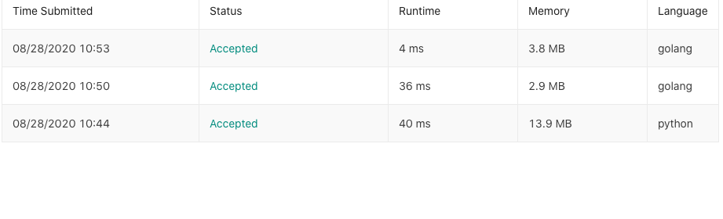

# Two sum 

1. two sum 
 - 정수로 된 어레이가 주어졌을 때 특정 타겟의 숫자가 나오는 두 숫자의 인덱스를 리스트로 반환하도록 한다. 

 ```shell
Given nums = [2, 7, 11, 15], target = 9,
Because nums[0] + nums[1] = 2 + 7 = 9,
return [0, 1].
 ```

요즘 Golang 문법을 공부하고 있는데 사실 배우면서 스크립트 언어만 사용해온 나에게 너무 불편했다.. 일단 환경 설정 부터, package 설치하려면 GOPATH에 대체 몇개의 뻘짓을 하고 있는지... 기초적인 환경설정 부분에서 시간을 너무 많이 빼앗기는 느낌적인 느낌... 그러다가 오늘 알고리즘 문제를 풀면서 느꼈다... 아 이래서 컴파일 언어를 golang을 많이 사용할 수 밖에 없구나.. 

우선 메모리 사용에서 몇배 차이가 났다. 


맨 밑이 파이썬으로 hash map을 이용한 풀이 이고 두번째가 golang을 이용하여 for loop를 두번 즉 O(n^2) 맨 위가 hash map 방식을 이용한 풀이이다.  두번째와 세번째는 뭐 런타임에서는 크게 차이가 나보이지는 않지만, 메모리가... 배 이상 차이나고 첫번째는 넘사벽.... 그냥 닥치고 golang 공부하라는 의미로 알겠습니다. 구글님.... 